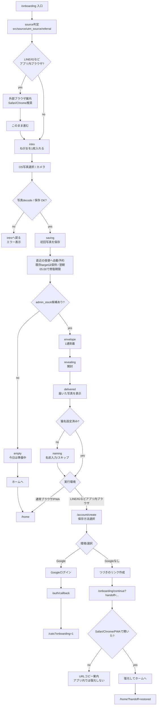

# オンボーディング遷移マップ / 離脱観察用

作成日: 2026-07-06
最終更新: 2026-07-21（Phase 1: 初回写真を夜便へ自動予約）

目的: Instagram / LINE / 通常ブラウザ / PWA から来た人が、どこで止まるかを観察するための現状マップ。

オーナーが公開前に実機で必ず通す手順は `docs/onboarding-owner-final-test-checklist.md` を正とする。
この文書は「理想の仕様」ではなく、現在の実装と運用判断に合わせた観察用の地図。

主な参照実装:

- `src/components/onboarding/OnboardingFlow.tsx`
- `src/app/account/create/page.tsx`
- `src/app/onboarding/continue/page.tsx`
- `src/lib/onboarding/progress.ts`
- `src/lib/onboarding/handoff.ts`
- `src/app/api/sleeping-delivery/exchange/route.ts`
- `src/lib/analytics/productAnalytics.ts`

## 0. 現在の重要な裁定

- 本番入口URLは `https://nyaruhodo.jp/onboarding` を正とする。
- キャンペーンURLは `src` を付ける。
- LINE / Instagram のアプリ内ブラウザでは、Googleログイン成功を期待しない。
- アプリ内ブラウザでは「つづきのリンク」を作り、Safari / Chrome / ホーム画面アプリで復元する導線を主に見る。
- オンボ即時の1通は `admin_stock` だけから届く。
- `admin_stock` はオンボ専用ではなく、通常20時便でも Tier3 fallback として届く対象に残る。
- オンボの `admin_stock` 選定は seed による分散が効く。全員が同じ1枚を受け取る設計ではない。
- オンボで投入した1枚は、通常の `cat_moments` として保存され、承認後は通常のねこだより配達候補に入る。
- オンボで最初に入れた1枚を、そのまま直近の夜便の交換対象へ自動予約する。20時前なら当日分、20時以降なら翌日分になる。
- オンボ完了時に2枚目は要求しない。通常ブラウザ/PWAはホームへ、アプリ内ブラウザは保存・handoffのため `/account/create` へ進む。
- resume / 完了済みre-entry / handoff復元時にも初回写真から予約を修復する。ただし、同じ日付に別の写真がすでに予約されていれば上書きしない。
- 初回写真から修復できるのは、予約日の翌朝05:00（自動開封時刻）より前まで。期限後は古い写真から新しい予約を作らない。
- `next=second_photo` と `from=onboarding_second_photo` は旧リンクの互換入力としてだけ受け付け、2枚目画面を再表示せず通常導線へ正規化する。
- PWA設置案内は一通目の開封直後には出さず、オンボ完了後のホーム側 install hint に一本化する。
- resetリンクはテスト用。実ユーザーのmainリンクとは観察上分ける。

## 1. 全体フロー



## 2. 画面 / 状態ごとの観察表

| 段階 | route/state | ユーザーに見えるもの | 主操作 | 成功時の次 | 離脱・失敗候補 | 主なイベント |
|---|---|---|---|---|---|---|
| 入口 | `/onboarding` | 紹介/キャンペーンリンクから開始 | なし | intro または外部ブラウザ案内 | URLを開いたが何もせず離脱 | `app_opened`, `onboarding_intro_view` |
| アプリ内ブラウザ案内 | `shouldShowExternalBrowserGuide` | LINE/Instagram内ならSafari/Chrome推奨 | URLコピー / このまま進む | intro | コピーで止まる、このまま進む前に離脱 | `inapp_browser_detected`, `onboarding_external_browser_url_copied`, `onboarding_embedded_browser_continue` |
| 写真投入前 | `intro` | ねがおを1枚入れる説明 | 写真選択 | OS picker | 価値が伝わらない、pickerでキャンセル | `onboarding_intro_view`, `onboarding_submit_photo_click`, `onboarding_photo_select_click` |
| 写真保存 | `saving` | 準備中 | なし | 初回写真を夜便へ予約し、envelope / empty | Android/LINE decode失敗、Storage保存失敗、予約保存失敗、通信失敗 | `onboarding_photo_submitted`, `evening_delivery_reserved`, `evening_delivery_reservation_failed`, `evening_delivery_reservation_skipped`, `photo_submitted`, `take_photo`, `photo_upload_error`, `onboarding_delivery_error` |
| 候補不足 | `empty` | 今日は準備中 | ホームへ | `/home` | 届かないと感じて離脱 | `onboarding_delivery_error` または配達未成立系 |
| 到着 | `envelope` | ねこだよりが届く | 開く | revealing | 封筒が押せると分からない | `onboarding_delivery_ready`, `onboarding_delivery_arrived`, `envelope_shown` |
| 開封中 | `revealing` | 届いた写真の表示演出 | なし | delivered | 写真ロード失敗、枠だけ表示 | `delivery_reveal_started`, `delivery_reveal_completed`, `delivery_reveal_photo_loaded`, `delivery_reveal_photo_error` |
| 届いた写真 | `delivered` | 届いたねこだより1枚 | 続ける | naming または通常環境は `/home`、アプリ内ブラウザは account/create | 写真が消える、今夜分の予約が伝わらない | `envelope_opened`, `onboarding_delivery_opened`, `onboarding_delivered_photo_confirmed`, `onboarding_completed` |
| 名前入力 | `naming` | この子の名前入力 | 名前を入れて進む / スキップ | 通常環境は `/home`、アプリ内ブラウザは account/create | 名前で詰まる | `cat_name_prompt_view`, `cat_name_entered`, `cat_name_skipped` |
| 保存方法 | `/account/create?from=onboarding`（主にアプリ内ブラウザ） | Google / つづきのリンク | Googleで続ける / つづきのリンク | cats / continue | Google拒否、handoff作成失敗 | `onboarding_album_prompt_view`, `account_create_cta_viewed`, `onboarding_google_continue_click`, `auth_google_started`, `auth_google_failed`, `auth_google_blocked_embedded_browser`, `onboarding_skip_click` |
| Google成功 | `/auth/callback` | Google認証 | 承認 | `/cats?onboarding=1` | Google Cloud/Supabase設定不備、アプリ内ブラウザ拒否 | `auth_google_started`, `auth_google_failed`, `onboarding_album_created`, `cat_album_created`, `onboarding_completed` |
| handoff作成 | account/create | つづきのリンクを作る | リンク作成 | `/onboarding/continue?...` | 作成失敗、コピーせず離脱 | `onboarding_album_created`, `cat_album_created`, `onboarding_completed` method=`handoff`, `handoff_url_copied` |
| handoff復元 | `/onboarding/continue` | 復元してホームへ | 復元してホームへ | 初回写真の夜便予約を修復し `/home?handoff=restored` | 使用済み、期限切れ、LINE/IG内で開いた | `onboarding_handoff_restored`, `onboarding_resumed`, `onboarding_handoff_restore_failed` |

## 3. 最小ファネル定義

まずはこの8段階を見る。

| step | 成功イベント | 補足 |
|---:|---|---|
| 1 | `onboarding_intro_view` | source別に見る |
| 2 | `onboarding_photo_select_click` | OS picker手前の意思 |
| 3 | `onboarding_photo_submitted` | 写真保存成功。`photo_upload_error` と対で見る |
| 4 | `evening_delivery_reserved` | 初回写真が直近の夜便へ保存された。`evening_delivery_reservation_failed` と対で見る |
| 5 | `onboarding_delivery_arrived` | オンボ即時の1通が届いた状態 |
| 6 | `onboarding_delivery_opened` | 届いた写真を開いた |
| 7 | `onboarding_completed` | 通常環境のホーム直行と、Google / handoff / already_connected を分ける |
| 8 | 予約した夜便の確認開始 → 開封 | `evening_delivery_reserved` を起点に20時便へつながったかを見る |

## 4. 観察すべき離脱ポイント

| 優先 | 観察ポイント | 見る指標 | 疑う原因 |
|---:|---|---|---|
| P0 | intro表示 → 写真選択クリック | `onboarding_intro_view` に対する `onboarding_photo_select_click` 率 | 初回価値が伝わらない、アプリ内ブラウザ警告が怖い |
| P0 | 写真選択クリック → 写真保存成功 | `onboarding_photo_select_click` → `onboarding_photo_submitted` | OS pickerキャンセル、Android/LINE decode、HEIC/大容量、Storage失敗 |
| P0 | 写真保存成功 → 夜便予約 | `onboarding_photo_submitted` → `evening_delivery_reserved` | localStorage保存失敗。期限切れ・既存予約保持は `evening_delivery_reservation_skipped` で分ける |
| P0 | 写真保存成功 → 配達到着 | `onboarding_photo_submitted` → `onboarding_delivery_arrived` | admin_stock不足、exchange/API失敗、signed URL失敗 |
| P0 | 到着 → 開封 | `onboarding_delivery_arrived` → `onboarding_delivery_opened` | 封筒が押せると分からない、写真枠だけ表示 |
| P0 | 開封 → 完了 | `onboarding_delivery_opened` → `onboarding_completed` | 続ける意味が弱い、名前入力で詰まる |
| P0 | アプリ内ブラウザの保存方法表示 → 完了 | `onboarding_album_prompt_view` → `onboarding_completed` | Google拒否、handoffが分からない、使用済みリンク |
| P0 | handoff作成 → 復元完了 | `onboarding_completed` method=`handoff` → `onboarding_handoff_restored` | LINE/IG内でcontinueを開く、コピーせず離脱、期限切れ |
| P1 | 夜便予約 → 20時便の開封 | `evening_delivery_reserved` → step8 | 20時便の理解不足、再訪されない、配達確認失敗 |

## 5. source / 環境軸

| 軸 | 値 |
|---|---|
| source | `instagram_bio`, `instagram_story`, `instagram_dm`, `referral`, `direct`, `unknown` |
| URL parameter | `src` が正。`source` / `utm_source` も互換で読む |
| display mode | `browser`, `standalone`, `unknown` |
| in-app browser | true / false |
| browser label | LINE / Instagram / Facebook / X / TikTok / WeChat / browser |
| platform | iOS / Android / other |
| account method | Google / handoff / already_connected / none |

sourceは初回読み取り後、同一セッション内で `sessionStorage` に保持される。
URLに `ref` / `referral` / `invite` がある場合は `referral` として扱う。

確定URL:

| 用途 | URL |
|---|---|
| bio | `https://nyaruhodo.jp/onboarding?src=instagram_bio` |
| DM返信 | `https://nyaruhodo.jp/onboarding?src=instagram_dm` |
| ストーリーズ | `https://nyaruhodo.jp/onboarding?src=instagram_story` |
| referral | 招待リンク側のURL。`ref` / `referral` / `invite` を含む場合は `referral` 扱い |

reset用URLはテストだけに使う。投稿3の実ユーザー導線では使わない。

## 6. Google / handoff の観察方針

アプリ内ブラウザではGoogleログインを成功させる設計ではない。
見るべきことは以下。

- LINE/IG内では、Googleが主導線として失敗に突っ込まないこと。
- 「つづきのリンク」が作れること。
- そのリンクをSafari / Chrome / PWAで開いて復元できること。
- 同じhandoffリンク2回目は使用済みになること。
- 期限切れ時に優しいエラーが出ること。

通常ブラウザでは、Googleログインが通ることを別途確認する。
Safari / ChromeでもGoogleが失敗する場合は、アプリ側ではなく Google Cloud / Supabase redirect 設定を疑う。

## 7. 配達プールとadmin_stock

オンボ即時交換:

- `mode="onboarding"` の場合、候補は `admin_stock` だけに絞る。
- `metadata.pool_kind = "admin_stock"`、`metadata.pool_kind = "admin-stock"`、`metadata.source = "admin-stock"` をadmin stockとして読む。
- 選定は通常と同じ `selectCandidate()` を通る。
- seed によって開始位置が変わるため、複数人が複数のstock写真に分散する。
- E2E: `distributes immediate onboarding exchange across admin stock photos` で固定済み。

通常20時便:

- 通常候補はユーザー投稿の `user_shared` が中心。
- `admin_stock` も Tier3 fallback として候補に残る。
- つまり `admin_stock` は「オンボ専用」ではなく「運営ストック」として通常便の保険にもなる。

運用上のカナリア:

- 本番で `admin_stock × approved × available` が0になると、オンボ即時交換が `empty` になり得る。
- 投稿3前に、管理画面でadmin stockの写真品質を確認する。
- `pending/shared/available` が0であることを見る。`private/available/pending` や `shared/hidden/pending` は管理キュー未審査とは別物。

## 8. オンボ写真の扱い

オンボでユーザーが入れた1枚:

- 通常の `cat_moments` に保存される。
- `ownSleepingPhotos` の同じ1枚を `recordOnboardingEveningDeliveryTarget()` で直近の夜便へ予約する。2枚目の入力は求めない。
- 20時前に撮った写真は当日分、20時以降に撮った写真は翌日分になる。
- resume / 完了済みre-entry / handoff復元では同じ処理を再実行して、未保存の予約を修復する。
- 同じ日付に別の `targetOwnPhotoId` があれば、その予約を優先して上書きしない。同じ写真なら予約済みとして扱う。
- 予約日の翌朝05:00以降は期限切れとして修復しない。
- `moderation_status = pending` で入り、管理審査対象になる。
- approve後、通常の20時便候補に入る。
- `この子の写真` 100枚枠には入らない。
- ねこだより候補としては通常の `ownSleepingPhotos` / `cat_moments` 側で扱う。

観察ポイント:

- オンボ写真がpendingに入るか。
- `evening_delivery_reserved` が同じ `submission_id` で重複せず、対応する `delivery_date_key` に保存されるか。
- 既存の夜便予約が、resume / handoff修復で上書きされないか。
- approve後に配達候補へ出るか。
- rejectしても投稿者本人の記録にどう見えるかは、規約文面と実装整合の確認対象。

## 9. PWA設置案内

現在の実装:

- 一通目を開いた直後は届いた写真と「つづける」だけを表示し、設置案内を挟まない。
- オンボ完了後、ホーム側の既存install hintで案内する。
- LINE/Instagram内では設置そのものより、Safari/Chromeで続ける導線を優先する。

見るイベント:

- ホーム側install hintのイベントを参照する。

観察したいこと:

- 開封直後の写真体験を設置案内が遮っていないか。
- オンボ完了後のホームで設置の再機会が届くか。
- PWA起動後、handoff復元済みデータが見えるか。

## 10. 計測クエリ観点

SQLは環境に合わせて調整する。見るべき差分は以下。

```txt
intro_view
  - photo_select_click
  = 初回CTA離脱

photo_select_click
  - onboarding_photo_submitted
  = 写真選択/保存離脱

onboarding_photo_submitted
  - evening_delivery_reserved
  = 初回写真の夜便予約離脱

evening_delivery_reserved
  - onboarding_delivery_arrived
  = オンボ即時配達までの離脱（夜便予約とは別経路）

onboarding_delivery_arrived
  - onboarding_delivery_opened
  = 開封離脱

onboarding_delivery_opened
  - onboarding_completed
  = 続ける/名前入力/保存導線離脱

onboarding_completed(method=handoff)
  - onboarding_handoff_restored
  = handoff復元離脱

evening_delivery_reserved
  - 夜便確認開始/開封
  = 初回写真から20時便への橋の失敗
```

## 11. 推奨ダッシュボード項目

| カード | 内容 |
|---|---|
| 入口別オンボ完走率 | source別に step1 → step7 |
| 写真保存失敗率 | platform/browser別の `photo_upload_error` |
| LINE/IG handoff復元率 | `inapp_browser_detected` → `onboarding_handoff_restored` |
| Google詰まり | `auth_google_started` → success / failed / blocked |
| 候補不足 | `onboarding_photo_submitted` 後に `empty` 相当になった件数 |
| 初回夜便予約 | `onboarding_photo_submitted` → `evening_delivery_reserved`。失敗は `evening_delivery_reservation_failed`、期限切れ/既存予約保持は `evening_delivery_reservation_skipped` |
| admin_stock健全性 | `admin_stock × approved × available` の件数 |
| 未審査滞留 | `pending/shared/available` の件数 |
| 写真枠だけ表示 | `delivery_reveal_photo_error` / signed URL系error |
| 初回夜便の到達 | `evening_delivery_reserved` → 夜便確認開始 → 成立 → 開封 |

## 12. 実機検証シナリオ

投稿3前に見る最小セット:

1. iPhone Safari: `/onboarding?src=instagram_bio` → 写真投入 → 夜便予約成立 → 1通開封 → 2枚目要求なしで `/home`
2. Android Chrome: `/onboarding?src=instagram_bio` → 写真投入 → 夜便予約成立 → 1通開封 → 2枚目要求なしで `/home`
3. LINE内ブラウザ iPhone: 入口 → 外部ブラウザ案内 → つづきのリンク → Safari/PWAで復元
4. LINE内ブラウザ Android: 入口 → 写真投入できるか → handoffでChrome/PWA復元
5. Instagram内ブラウザ iPhone: Googleに突っ込まずhandoff主導線が出るか
6. PWA: handoff復元後にホームを開き、写真/届いた/猫情報が見えるか
7. resetリンク: テストデータが増殖しないか。ただし本番mainリンクとは別扱いで見る
8. 旧URL: `/home?from=onboarding_second_photo` と account/continue の `next=second_photo` を開き、2枚目画面を出さずURLが通常状態へ正規化されるか

## 13. 注意

- 写真URL、signed URL、storage path、猫名、メールアドレスはanalyticsに載せない。
- アプリ内ブラウザ検知は漏れる前提。検知できた時の分岐だけでなく、Google失敗後の復帰案内も見る。
- `empty` は写真保存成功後の状態であり、写真投入失敗ではない。`photo_upload_error` と分けて見る。
- `onboarding_completed` は複数地点で発火し得る。分析時は `method` を必ず見る。
- `next=second_photo` / `from=onboarding_second_photo` は旧handoff・ブックマークを壊さないための互換入力であり、現行フローの分岐ではない。
- `admin_stock` は初回体験の品質そのもの。件数だけでなく写真の中身を人間が見る。
