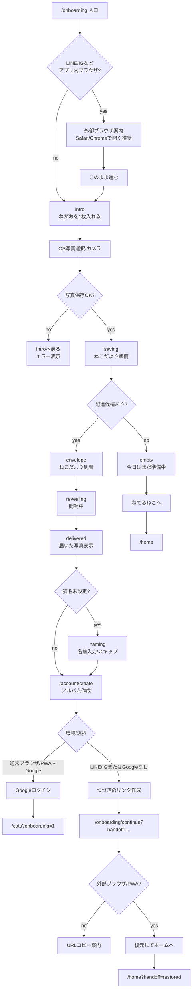

# オンボーディング遷移マップ / 離脱観察用

作成日: 2026-07-06

目的: 招待リンク/Instagram/LINE/通常ブラウザ/PWA から来た人が、どこで止まるかを観察するための現状マップ。

参照実装:
- `src/components/onboarding/OnboardingFlow.tsx`
- `src/app/account/create/page.tsx`
- `src/app/onboarding/continue/page.tsx`
- `src/lib/onboarding/handoff.ts`
- `src/lib/analytics/productAnalytics.ts`

## 1. 全体フロー



## 2. 画面/状態ごとの観察表

| 段階 | route/state | ユーザーに見えるもの | 主操作 | 成功時の次 | 失敗/離脱候補 | 主なイベント |
|---|---|---|---|---|---|---|
| 入口 | `/onboarding` | 紹介/招待リンクから開始 | なし | intro または外部ブラウザ案内 | URLを開いたが何もせず離脱 | `app_opened`, `onboarding_intro_view` |
| アプリ内ブラウザ案内 | `shouldShowExternalBrowserGuide` | LINE/Instagram内ならSafari/Chrome推奨 | URLコピー / このまま進む | intro | コピーで止まる、このまま進む前に離脱 | `inapp_browser_detected`, `onboarding_external_browser_url_copied`, `onboarding_embedded_browser_continue` |
| 写真投入前 | `intro` | 「ねがおを1枚入れる」 | 写真選択 | OS picker | CTA未クリック、OS pickerでキャンセル | `onboarding_submit_photo_click`, `onboarding_photo_select_click` |
| 写真保存 | `saving` | 「ねこだよりを準備しています…」 | なし | envelope / empty | Android/LINEでdecode失敗、Storage保存失敗、配達作成失敗 | `onboarding_photo_submitted`, `photo_submitted`, `take_photo`, `photo_upload_error`, `onboarding_delivery_error` |
| 候補なし | `empty` | 「今日はまだ、届くねこだよりを準備中です。」 | ねてるねこへ | `/home` | 届かないと感じて離脱 | `onboarding_delivery_error` または配達未成立系 |
| 到着 | `envelope` | 封筒/「ねこだよりが届きました」 | ねこだよりを開く | revealing | 開封ボタンを押さず離脱 | `onboarding_delivery_ready`, `onboarding_delivery_arrived`, `envelope_shown` |
| 開封中 | `revealing` | 写真の現像/表示 | なし | delivered | 写真ロード失敗、途中離脱 | `delivery_reveal_started`, `delivery_reveal_completed`, `delivery_reveal_photo_loaded`, `delivery_reveal_photo_error` |
| 届いた写真表示 | `delivered` | 届いたねこだより + 自分の写真 | つづける | naming or account/create | 写真が枠だけ、つづける前に離脱 | `envelope_opened`, `onboarding_delivery_opened`, `onboarding_delivered_photo_confirmed`, `onboarding_completed` |
| 名前入力 | `naming` | この子の名前入力 | 名前を入れて進む / 名前なし | account/create | 名前で詰まる、キーボードで離脱 | `cat_name_prompt_view`, `cat_name_entered`, `cat_name_skipped` |
| アルバム作成 | `/account/create?from=onboarding` | アルバム作成/保存導線 | Google / つづきのリンク | cats/home/continue | Googleで詰まる、handoff作成失敗 | `onboarding_album_prompt_view`, `account_create_cta_viewed`, `onboarding_google_continue_click`, `auth_google_started`, `auth_google_failed`, `auth_google_blocked_embedded_browser`, `onboarding_skip_click` |
| Google成功 | `/auth/callback` → account/create | Google認証 | Google承認 | `/cats?onboarding=1` | Google Cloud/Supabase callback設定不備、戻れない | `auth_google_started`, `auth_google_failed`, `onboarding_album_created`, `cat_album_created`, `onboarding_completed` |
| handoff作成 | account/create | 「つづきのリンクを作る」 | リンク作成 | `/onboarding/continue?...` | handoff作成失敗 | `onboarding_album_created`, `cat_album_created`, `onboarding_completed` method=`handoff` |
| handoff復元 | `/onboarding/continue` | 復元してホームへ | 復元してホームへ | `/home?handoff=restored` | 使用済み/期限切れ/LINE内で開いた | `onboarding_handoff_restored`, `onboarding_resumed`, `onboarding_handoff_restore_failed`, `handoff_url_copied` |

## 3. 主要な離脱ポイント

| 優先 | 観察ポイント | 見る指標 | 疑う原因 |
|---:|---|---|---|
| P0 | intro表示 → 写真選択クリック | `onboarding_intro_view` に対する `onboarding_photo_select_click` 率 | 最初の価値が伝わらない、LINE/IG警告で不安 |
| P0 | 写真選択クリック → 写真保存成功 | `onboarding_photo_select_click` → `onboarding_photo_submitted` | OS pickerキャンセル、Android/LINE decode、HEIC/大容量、Storage失敗 |
| P0 | 写真保存成功 → 配達到着 | `onboarding_photo_submitted` → `onboarding_delivery_arrived` | 配達候補不足、exchange/API失敗、signed URL失敗 |
| P0 | 到着 → 開封 | `onboarding_delivery_arrived` → `onboarding_delivery_opened` | 封筒が押せると分からない、写真枠だけ表示 |
| P0 | 開封 → account/create表示 | `onboarding_delivery_opened` → `onboarding_album_prompt_view` | 「つづける」の意味が弱い、名前入力で詰まる |
| P0 | account/create → 完了 | `onboarding_album_prompt_view` → `onboarding_completed` | Google拒否、handoffが分からない、使用済みリンク |
| P0 | handoff作成 → 復元完了 | `onboarding_completed` method=`handoff` → `onboarding_handoff_restored` | LINE/IG内でcontinueを開く、コピーせず離脱、期限切れ |

## 4. 最小ファネル定義

まずはこの7段で見る。

| step | 成功イベント | 補足 |
|---:|---|---|
| 1 | `onboarding_intro_view` | source別に見る。`instagram_story`, `instagram_bio`, `referral`, `direct` |
| 2 | `onboarding_photo_select_click` | OS picker手前の意思 |
| 3 | `onboarding_photo_submitted` | 写真保存成功。`photo_upload_error` と対で見る |
| 4 | `onboarding_delivery_arrived` | 1通届いた状態 |
| 5 | `onboarding_delivery_opened` | 届いた写真を開いた |
| 6 | `onboarding_album_prompt_view` | アルバム/保存導線に到達 |
| 7 | `onboarding_completed` | method=`delivery_confirmed` / `google` / `handoff` / `already_connected` を分ける |

## 5. 環境別に必ず分ける軸

| 軸 | 値 |
|---|---|
| source | `instagram_story`, `instagram_bio`, `instagram_dm`, `referral`, `direct`, `unknown` |
| display mode | `browser`, `standalone`, `unknown` |
| in-app browser | true/false |
| browser label | LINE / Instagram / Facebook / X / TikTok / WeChat / browser |
| platform | iOS / Android / other |
| account method | Google / handoff / already_connected / none |

現状、`app_opened` は `is_in_app_browser` を持つ。`/account/create` では `inapp_browser_detected` と `auth_google_blocked_embedded_browser` を出す。オンボ写真エラーは `photo_upload_error` に `file_size_bucket`, `file_type`, `file_extension`, `error_stage` が入る。

## 6. 離脱調査用クエリ観点

実SQLは環境に合わせるが、見るべき差分は以下。

```txt
intro_view
  - photo_select_click
  = 最初のCTA離脱

photo_select_click
  - onboarding_photo_submitted
  = 写真選択/保存離脱

onboarding_photo_submitted
  - onboarding_delivery_arrived
  = 配達生成離脱

onboarding_delivery_arrived
  - onboarding_delivery_opened
  = 開封離脱

onboarding_delivery_opened
  - onboarding_album_prompt_view
  = 続ける/名前入力離脱

onboarding_album_prompt_view
  - onboarding_completed
  = Google/handoff/保存導線離脱

onboarding_completed(method=handoff)
  - onboarding_handoff_restored
  = handoff復元離脱
```

## 7. 観察時の注意

- `onboarding_completed` は複数地点で発火する。分析時は `method` を必ず見る。
- アプリ内ブラウザではGoogle成功を期待しない。観察すべきは「Googleが主導線から外れ、handoffに進めるか」。
- `empty` は写真保存自体は成功している。離脱ではなく「配達候補不足/配達不成立」として別集計する。
- resetリンクでのテストは実ユーザーのmainリンクと挙動が違うことがある。reset由来は可能なら別source/テスト扱いで見る。
- 写真URL、signed URL、storage path、猫名、メールアドレスはイベントに入れない。

## 8. 推奨ダッシュボード項目

| カード | 内容 |
|---|---|
| 入口別オンボ完走率 | source別に step1→step7 |
| 写真保存失敗率 | platform/browser別の `photo_upload_error` |
| LINE/IG handoff復元率 | `inapp_browser_detected` → `onboarding_handoff_restored` |
| Google詰まり | `auth_google_started` → success / failed / blocked |
| 候補不足 | `onboarding_photo_submitted` 後に `empty` 相当になった件数 |
| 枠だけ表示疑い | `delivery_reveal_photo_error` / signed URL系error |
## 9. 2026-07-06 追記: source計測と2日目への橋

### sourceの確定URL

現行の計測入口は `src` を主として使う。`source` / `utm_source` も互換として読む。

| 用途 | URL |
|---|---|
| bio | `<PWA_URL>/onboarding?src=instagram_bio` |
| DM返信1 | `<PWA_URL>/onboarding?src=instagram_dm` |
| ストーリーズリンク | `<PWA_URL>/onboarding?src=instagram_story` |

許可値は `instagram_bio` / `instagram_story` / `instagram_dm` / `referral` / `direct`。許可外は `unknown`。
初回読み取り後は同一セッション内で `sessionStorage` に保持し、`app_opened` とオンボーディング系イベントの `source` に載せる。

### emptyコホート

オンボ即時交換はadmin_stock固定にするため、先行期の `empty` は通常プール不足ではなく「運営ストック全滅」のカナリアとして扱う。

追加して見る指標:

```txt
onboarding_photo_submitted
  - onboarding_delivery_arrived
  = emptyまたは交換失敗

emptyコホート
  -> 同日20時便の成立率
```

### step8: 2日目への橋

ファネルの橋指標として、step8を以下で見る。

```txt
step8 = 翌日、同一identityの再訪（standalone優先）または2枚目の「とる」
```

オンボ完了時、20時前なら `onboarding_second_photo_prompt_view` を出し、二枚目導線の押下を `onboarding_second_photo_submitted` として記録する。

### 監視カード

追加で見るカード:

- オンボ例外IP制限の発動数（app_events記録済み）
- `source=unknown` の比率（キャンペーンURLの漏れやコピー間違い）
- `inapp_browser_detected` に対する `onboarding_handoff_restored` 率

### 封筒タップ実装

オンボの封筒は `OnboardingFlow` 内の独自実装で、本便ホームの開封とはコンポーネント共有していない。
ただし、現在はタップ後の `envelope -> revealing -> delivered` という状態遷移と、写真表示の完了イベントを個別に持っている。
本便P0修正と同じ「押したあとに空白だけにしない」観点で、別途スクリーンショット確認対象にする。

### PWA設置案内の現状

オンボーディング末尾に「ホーム画面に追加」案内ステップは存在しない。
現在のPWA install hintはホーム側 `src/components/home/HomeInput.tsx` にあり、`beforeinstallprompt` とiOS手順案内を扱う。
そのため、キャンペーンDM文言の「とちゅうで案内が出ます」は現実装と不一致。投稿前コピー側で修正が必要。
