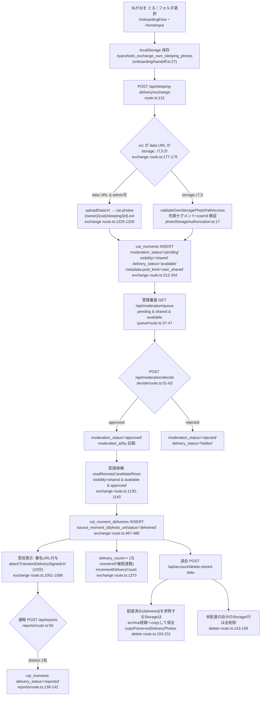
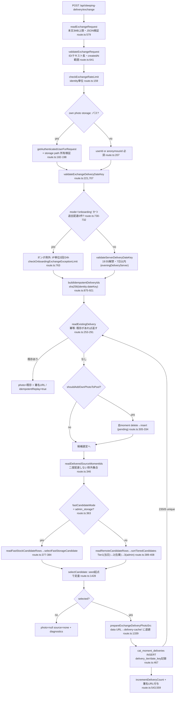
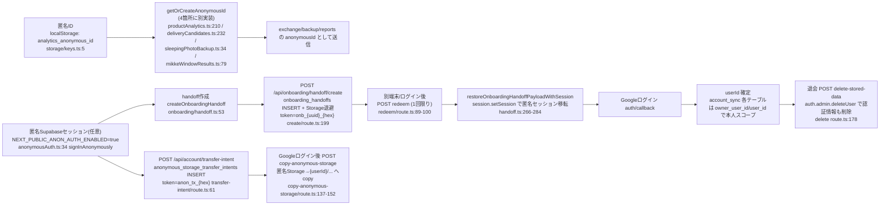
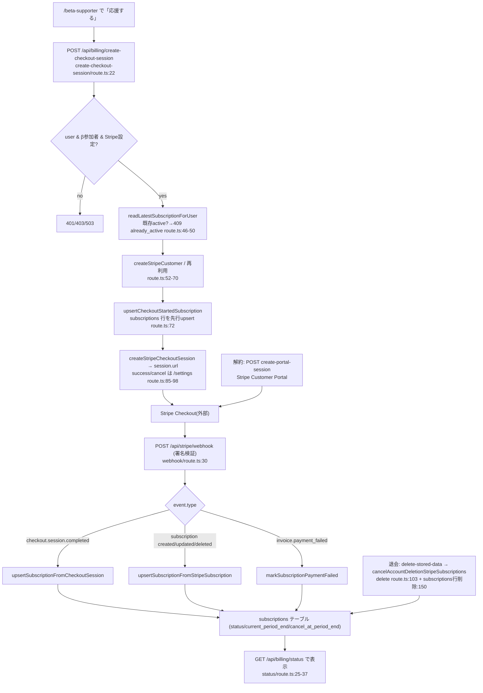
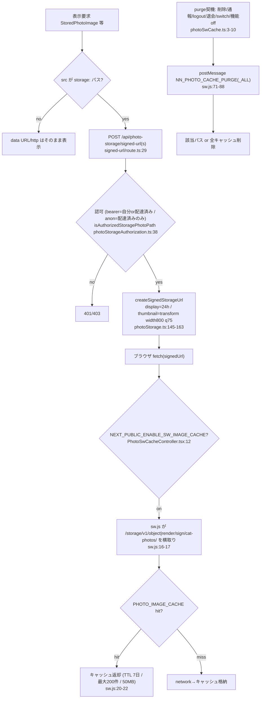
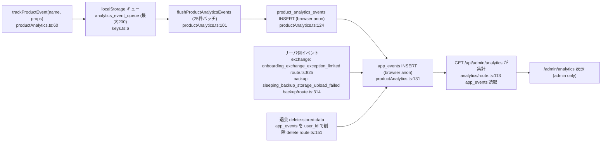

# data-flows.md — システム地図 成果物2（データフロー図）

> 出典はコードのみ。実コードの関数・テーブル・バケット名で描く（概念図にしない）。
> バケットは全て `cat-photos`（`src/lib/photoStorage.ts:3` `CAT_PHOTOS_BUCKET`）。
> 作成: 2026-07-07。

---

## 1. 写真の一生

要点（出典）:
- pendingデフォルトは exchange/backup/onboarding のinsert全てで一貫（`exchange route.ts:320`, `backup/route.ts:137`）。
  ただし admin stock のみ `approved` で入る（`stock/route.ts:152`）。
- rejectは投稿者の記録を消さない（`delivery_status='hidden'` にするだけ。行は残る。`decide/route.ts:58-62`）。
- 退会時、**配達済み写真は archive にコピーして受信者側に保全**、その参照を差し替える（`delete route.ts:210-214`）。

---

## 2. 20時の交換（exchange API内部）

要点（出典）:
- 冪等IDは新旧2系統（`buildIdempotentDeliveryId` sha256 と `buildLegacyIdempotentDeliveryId` 32bit hash）を両方照合（`route.ts:908-921`）。
- Tier判定: admin_stock=3、当日pool_date一致=1、それ以外=2（`getDeliveryTier route.ts:1417-1426`）。
- `mode='onboarding'` は20時前でも配達解禁されるが、過去配達0件＋IP 3回/24hの二重ガード（`route.ts:730-750`）。

---

## 3. identity（識別子のライフサイクル）

要点（出典）:
- 匿名IDは**localStorageの `analytics_anonymous_id` を4関数が各自 get-or-create**（重複実装。後述 issues D2）。
- handoff token（`onb_...`）と transfer intent token（`anon_tx_...`）は別系統。前者はオンボ状態全体、後者はStorage移送のみ。
- 退会は auth user まで削除（`supabase.auth.admin.deleteUser` `delete route.ts:178`）＝匿名性の切断。

---

## 4. 課金（Stripe）

要点（出典）:
- Checkout開始時に `subscriptions` を先行upsert（`checkout_started`）、確定はwebhook（`webhook/route.ts:41-64`）。
- webhookは署名検証のみが門番（ユーザ認証なし。`webhook/route.ts:23,30`）。
- 退会フローは billing解約を最初に実行し、失敗したら削除を中断（`delete route.ts:103-116`）。

---

## 5. 画像配信（署名URL・SWキャッシュ階層）

要点（出典）:
- 署名URLは display=`DISPLAY_SIGNED_URL_SECONDS`=24時間（`photoStorage.ts:6`）。exchange内の一時URLは10分（`exchange route.ts:117`）。
- SWキャッシュは**フラグoffなら完全に無効**（`PhotoSwCacheController` が config を送らない）。purge理由は7種（`photoSwCache.ts:3-10`）。

---

## 6. 計測（app_events / product_analytics_events）

PIIの有無に関する注記（出典）:
- クライアントイベントは `anonymous_id`（localStorage由来）・`user_id`・`route`・`referrer`・`properties` を持つ（`productAnalytics.ts:37-49`）。
  referrerは `sanitizeReferrer` で正規化、propertiesは `sanitizeProperties` を通す（`productAnalytics.ts:73,86`）。写真URLや本文は載せない設計。
- `anonymous_id` は端末識別子として準PII。**退会削除は `user_id` 一致行のみ**（`delete route.ts:151`）＝
  ログイン前に貯まった `anonymous_id` だけのイベントは退会後も残りうる（後述 issues D1）。
- サーバ側イベントはIPを生では入れず `hashText(ipKey)` 化（`exchange route.ts:818`）。

---

## テーブル・バケット参照インデックス（この文書で登場したもの）

- テーブル: `cat_moments` / `cat_moment_deliveries` / `cat_moment_cats` / `photo_reports` /
  `subscriptions` / `onboarding_handoffs` / `anonymous_storage_transfer_intents` /
  `product_analytics_events` / `app_events` / `beta_feedback` / `referral_codes` / `referral_claims` /
  `cats` / `record_logs` / `collection_photos` / `account_sync_state` /（詳細は data-inventory.md）
- バケット: `cat-photos`（単一）
