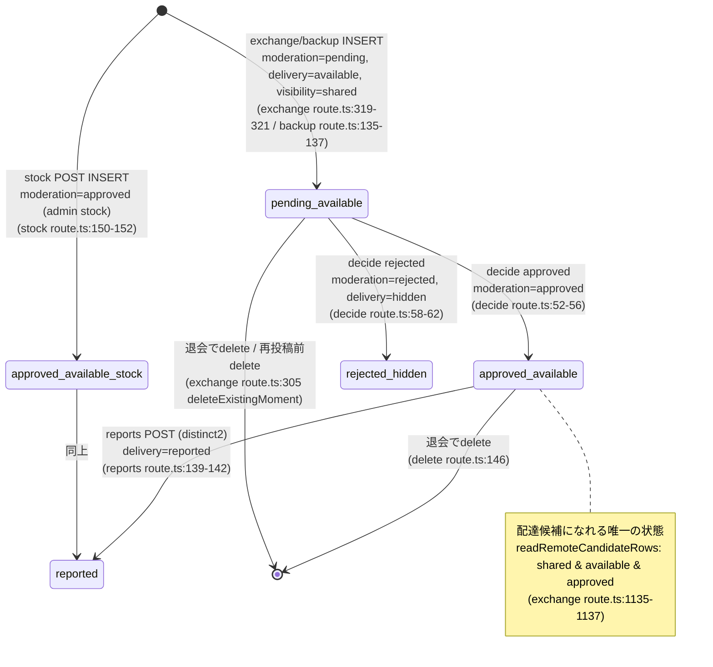

# photo-states.md — システム地図 成果物3-2（状態機械）

> `cat_moments` の `moderation_status` × `delivery_status` × `visibility` の組合せと遷移。
> どのAPIがどの遷移を起こすか、ありえない組合せも明記。出典はコードのみ。作成: 2026-07-07。

---

## 1. 列の取りうる値（DB制約）

出典: `supabase/migrations/20260602093000_create_cat_moment_tables.sql:32-37` と
`20260613090000_spec_v1_3_delivery_moderation.sql:2-3`。

- `state`: `sleeping` のみ（`:33`）
- `visibility`: `private` | `shared`（`:35`）
- `delivery_status`: `available` | `hidden` | `reported`（`:37`）
- `moderation_status`: `pending` | `approved` | `rejected`（`spec_v1_3:3`。default `pending`）

理論上の組合せ = 2(visibility) × 3(delivery) × 3(moderation) = **18**。実際に生成/遷移するのは下記のみ。

---

## 2. 状態遷移図（shared のねがお）

---

## 3. 状態→意味・可視性の対応表

| moderation | delivery | visibility | 意味 | 配達候補? | 生成/到達元 |
|---|---|---|---|---|---|
| pending | available | shared | 投稿直後・審査待ち | ❌（approved条件で除外 `route.ts:1250`） | exchange/backup insert |
| approved | available | shared | 承認済み・配達可 | ✅ | decide approved / stock |
| rejected | hidden | shared | 却下（投稿者記録は残る） | ❌ | decide rejected |
| approved | reported | shared | 承認後に2名通報で除外 | ❌（available条件で除外 `route.ts:1253`） | reports |
| approved | hidden | shared | （decideのrejectはmoderation=rejectedとhiddenを同時set。approved+hiddenは通常出ない） | ❌ | — |

---

## 4. 「ありえないはずの組合せ」（コード上で生成経路が無い）

- **`private` は cat_moments のプール系では実質未使用**: exchange/backup/stock は全て
  `visibility: "shared"` でinsert（`exchange route.ts:321`, `backup route.ts:135`, `stock route.ts:145`）。
  制約上 `private` は許されるが、書き込み経路が無い（診断・配達は全て `visibility='shared'` 前提）。
- **`pending` + `hidden`**: pendingは常にavailableで生成され、hiddenへ動かすのはdecide reject時のみで、
  そのときmoderationも同時にrejectedになる（`decide route.ts:58-62`）。→ pending+hiddenは生成されない。
- **`rejected` + `available`**: rejectは必ず `delivery_status='hidden'` を同時set（`decide route.ts:60`）。
  → rejected+available は生成されない（もし存在すれば配達候補にならないが「却下なのにavailable」の不整合）。
- **`rejected` + `reported`**: reportsはsource_photo_id基準で `delivery_status='reported'` にするだけで
  moderationは触らない（`reports route.ts:141`）。理論上 rejected行に通報が付けば rejected+reported も
  ありうるが、rejectedは既にhiddenで配達停止済みのため通報経路（配達実績検証 `reports route.ts:70`）に
  乗らない → 実際には生成されない。

---

## 5. cat_moment_deliveries 側の状態（配達物）

出典: `20260602093000_...:81`（status制約）。
- `status`: `delivered` | `kept` | `dismissed` | `hidden` | `reported`
- 生成は exchange の insert で `status='delivered'`（`exchange route.ts:477`）。
- `kept`/`dismissed` はクライアント側の「とっておく／閉じる」体験に対応（本APIスコープ外・別経路）。
- 退会保全対象は `PRESERVED_DELIVERY_STATUSES`（`accountDeletionStorage.ts` 参照。delivered/kept系を保全）。
- FK `user_id on delete set null`（`:67`）＝退会でユーザ削除されても配達行は残り匿名化。

---

## 6. 状態遷移を起こすAPIの一覧（逆引き）

| API | 起こす遷移 | 出典 |
|---|---|---|
| exchange POST | [*]→pending_available（自moment）、delivery行生成 | `exchange route.ts:312,467` |
| backup POST | [*]→pending_available | `backup route.ts:127` |
| stock POST | [*]→approved_available（admin stock） | `stock route.ts:142` |
| moderation/decide POST | pending→approved / pending→rejected+hidden | `decide route.ts:51-65` |
| reports POST | approved_available→reported（distinct2で発火） | `reports route.ts:139` |
| account/delete POST | 任意→delete（自分のmoment） | `delete route.ts:146` |

---

## サマリ（この文書分）

- 理論上の組合せ 18 のうち、**実際に生成・遷移するのは 4 状態**（pending/available、approved/available、
  rejected/hidden、approved/reported）＋admin stockのapproved/available。
- 「ありえない組合せ」 = `private` 全般・pending+hidden・rejected+available・rejected+reported。
  もしこれらが本番に存在したら、書き込み経路外の混入（手動SQL等）の疑い。
- 配達候補になれるのは **approved & available & shared** の1状態のみ（`exchange route.ts:1135-1137,1250-1253`）。
