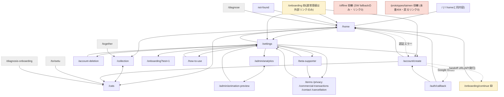
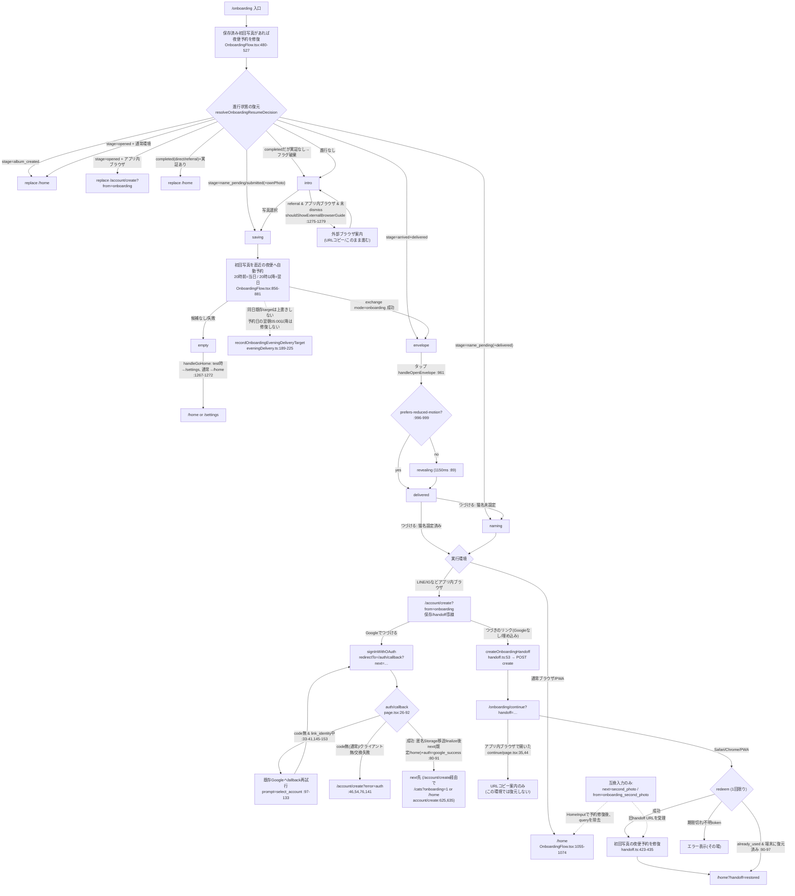
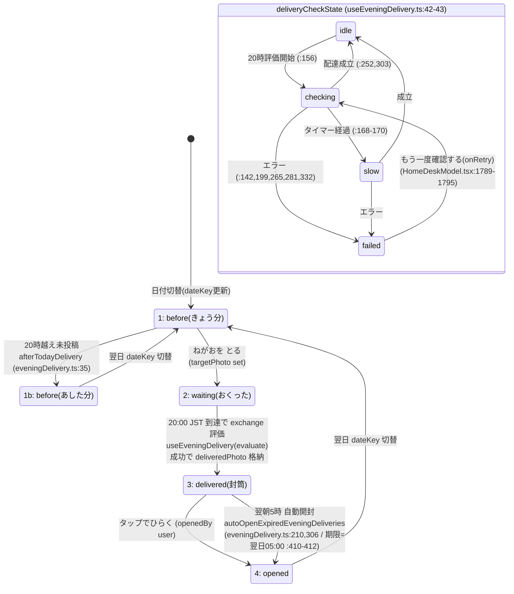
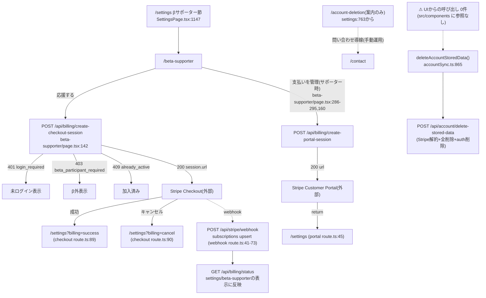

# screen-flows.md — システム地図 成果物5（画面遷移図）

> 出典はコードのみ（辺=リンク・router.push/replace・redirect・window.location）。全て `ファイル:行` 付き。
> 作成: 2026-07-07 / 最終更新: 2026-07-21（Phase 1: 初回写真の夜便自動予約）。
> 図1=俯瞰、図2=オンボーディング詳細、図3=ホーム状態機械、図4=課金・退会。

---

## 1. 全画面遷移図（俯瞰）

凡例: 🟨=孤立（内部リンクからの入次数0。外部URL/SW/API経由でのみ到達）／🟥=行き止まり（画面内に他画面への遷移が無い）

### 辺の出典（主要なもの）

| 辺 | 出典 |
|---|---|
| home⇄collection⇄cats（下部ナビ3タブ） | `src/components/navigation/BottomNavigation.tsx:40-58` |
| home→settings | `src/components/home/HomeDeskModel.tsx:456` |
| home→cats / home→collection（stow後遷移） | `src/components/home/HomeInput.tsx:1729,1733` |
| home→/account/create?error=auth（認証エラー） | `HomeInput.tsx:573,599` |
| collection→cats / collection→home | `src/components/collection/CollectionPage.tsx:1309,1803` |
| cats→home | `src/components/cats/CatsPage.tsx:1317` |
| settings→各先（home/account/削除案内/admin/onboarding?test=1/how-to-use/法務5種/beta-supporter） | `SettingsPage.tsx:624,752,763,957,975,1069,1074,1079,1084,1089,1094,1147` |
| beta-supporter→settings・法務 | `beta-supporter/page.tsx:175,317-329` |
| 法務各ページ→settings（戻る） | `LegalPage.tsx:415` |
| how-to-use→settings | `how-to-use/page.tsx:8` |
| admin/analytics⇄animation-preview、preview→settings | `AdminAnalyticsClient.tsx:113`, `AdminAnimationPreviewClient.tsx:116,179` |
| onboarding→home（replace/push） | `OnboardingFlow.tsx:371,387,867,1272` |
| onboarding→settings（test tools時のみ） | `OnboardingFlow.tsx:1268` |
| onboarding→/account/create | `OnboardingFlow.tsx:392-395,858-864` |
| account/create→home / →cats?onboarding=1 | `account/create/page.tsx:573,635,625` |
| auth/callback→next(既定/home)+auth=google_success / →account/create?error=auth | `auth/callback/page.tsx:89-91,46,54,76,141,162-178` |
| onboarding/continue→/home?handoff=restored | `onboarding/continue/page.tsx:104-108` |
| handoff URL発行（→/onboarding/continue） | `api/onboarding/handoff/create/route.ts:92` |
| not-found→home | `src/app/not-found.tsx:17` |
| 旧4リダイレクト | `together/page.tsx:3`, `torisetu/page.tsx:3`, `diagnose/page.tsx:3`, `diagnosis-onboarding/page.tsx:3` |
| /（root）=home同内容（redirectではなく同コンポーネント） | `src/app/page.tsx:1-7`, `src/app/home/HomePageContent.tsx` |

### 孤立・行き止まりの判定根拠

- **/offline**: ページ内にリンク・ボタン遷移なし（`offline/page.tsx` に href/router 0件）。到達はSWの
  オフラインfallbackのみ（`public/sw.js:4` `OFFLINE_URL`）。→ 🟨🟥
- **/prototypes/taimen**: 内部リンク0件・戻るリンクなし・本番は404（`prototypes/layout.tsx:7-9`）。→ 🟨🟥(dev専用)
- **/onboarding/continue**: 内部リンク0件。到達はAPI発行のcontinueUrlのみ（意図的な外部URL入口）。→ 🟨
- **/onboarding**: 内部の通常導線が無い（settingsの `?test=1` はテスト用 `SettingsPage.tsx:975`）。
  `/home` 側に未完了ユーザーをonboardingへ誘導するコードは無い（`src/app/home/*.tsx` に onboarding 参照0件）。
  → 主入口は外部リンク（bio等）のみ。🟨
- **/auth/callback**: 全分岐が自動遷移（成功→next、失敗→account/create?error=auth）で滞留しない。行き止まりではない。

---

## 2. オンボーディング詳細図（分岐条件つき）

### 既存 `docs/onboarding-transition-map-2026-07-06.md` との照合（コードが正・mapの改訂必要箇所）

| # | map側の記述 | コードの現実 | 出典 |
|---|---|---|---|
| 1 | 2枚目予告と2枚目入力が現行フロー | Phase 1では初回写真を直近の夜便へ自動予約し、2枚目は要求しない | `OnboardingFlow.tsx:856-881`, `eveningDelivery.ts:189-225` |
| 2 | 完了後は保存方法選択へ進む | 通常ブラウザ/PWAは `/home` へ直行。アプリ内ブラウザだけ保存・handoffのため `/account/create` へ進む | `OnboardingFlow.tsx:1055-1074` |
| 3 | Google成功: `/auth/callback` → `/cats?onboarding=1`（map:67-68,97） | callbackは `next`（既定 `/home`）へ `auth=google_success` 付きで戻るだけ。`/cats?onboarding=1` は account/create 側の分岐 | `auth/callback/page.tsx:89-91,162-168`, `account/create/page.tsx:625` |
| 4 | handoff復元後は `/home?handoff=restored` | 復元した初回写真から夜便予約も修復する。旧 `next=second_photo` は互換入力としてのみ残り、Home側で通常URLへ正規化する | `handoff.ts:423-435`, `HomeInput.tsx:406-424` |
| 5 | 再訪・復元経路（progress stageによる resume 分岐）がmapに無い | 初回写真があれば予約を冪等修復し、album_created/openedは通常環境でhome、openedのアプリ内ブラウザだけaccount/create。arrived→envelope、name_pending→naming/saving、submitted→saving | `OnboardingFlow.tsx:480-539`, `stateMachine.ts:10-50` |
| 6 | empty→「ホームへ」= /home のみ（map:77-78,89） | test tools有効時は /settings へ | `OnboardingFlow.tsx:1267-1272` |
| 7 | 初回写真の予約修復条件が未記載 | 同日既存targetを上書きせず、予約日の翌朝05:00以降は古い初回写真から修復しない | `eveningDelivery.ts:189-225` |

map §0の裁定（admin_stockのみ・seed分散・通常プール合流）はコードと一致（`exchange route.ts:396-401,1453-1455,312-334`）。

---

## 3. ホーム状態遷移図（state1〜4＋deliveryCheckState）

deskState対応: `getDeskState`（`HomeDeskModel.tsx`）= waiting→"2" / delivered→"3" / opened→"4" /
before→isTodayDelivery?"1":"1b"。EveningHomeState定義は `eveningDelivery.ts:30-54`。

- 表示コピー対応: checking中は「ねこだよりを確認しています…／もうすぐ、とどく」
  （`HomeDeskModel.tsx:1775-1778`）、slow/failedは再試行ボタン（`:1783-1797`）。
- late-sent / empty-after は state表示上のphase（20時以降にとった/とらなかった日の文言。
  `HomeDeskModel.tsx:1728-1756,1808-1814`）。
- 20時境界はサーバ側でも検証（exchange解禁 19:55:00、`eveningDeliveryServer` 経由。
  `exchange route.ts:221,760`）。

---

## 4. 課金・退会の遷移（画面×API対応）

- **退会のUI遷移は存在しない**: 退会APIとクライアント関数（`deleteAccountStoredData` `accountSync.ts:865`）は
  実装済みだが、`src/components` に呼び出しが無い（grep 0件）。現行の退会は
  `/account-deletion` の案内→問い合わせ→手動、が唯一の経路。

---

## サマリ（この文書分）

- 俯瞰図: ノード24ページ／孤立4（offline・prototypes・onboarding/continue・onboarding本体の通常導線）／
  行き止まり2（offline・prototypes/taimen）。
- オンボ詳細: 初回写真の夜便自動予約、resume/re-entry/handoff修復、完了後の環境別遷移、旧2枚目URLの互換正規化を反映。照合項目 **7件**（コードが正）。
- ホーム: 5状態＋checkサブ状態4、トリガー3種（とる/20時/翌朝5時）。
- 課金・退会: 画面×API対応6本。退会はAPIのみ存在しUI未配線（issues追補へ）。
